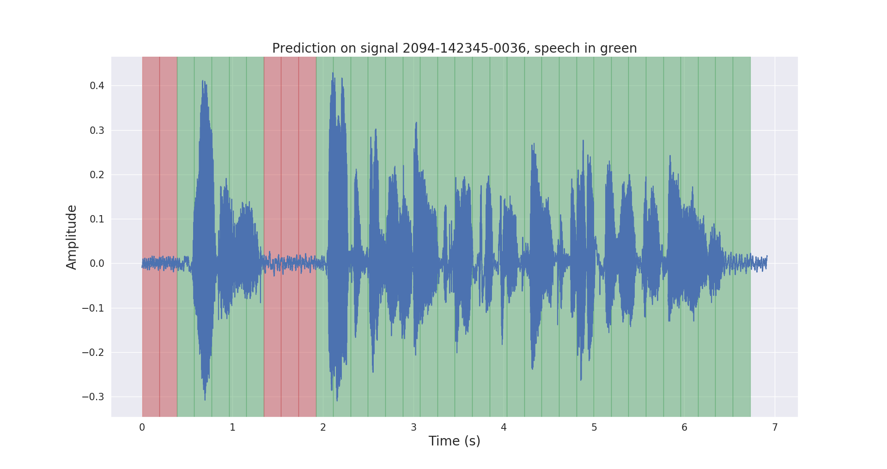

# Voice Activity Detection project

Keywords: Python, TensorFlow, Deep Learning, 
Time Series classification

## 0. Installation

This project was designed for:
* Python 3.6
* TensorFlow 1.12.0

Please install requirements & project:
```
$ cd /path/to/project/
$ git clone https://github.com/filippogiruzzi/voice_activity_detection.git
$ cd voice_activity_detection/
$ pip3 install -r requirements.txt
$ pip3 install -e . --user --upgrade
```

## 1. Introduction

### 1.1 Goal

The purpose of this project is to design and implement 
a real-time Voice Activity Detection algorithm based on Deep Learning.

The designed solution is based on MFCC feature extraction and 
a 1D-Resnet model that classifies whether a audio signal is 
speech or noise.

### 1.2 Results

| Model | Train acc. | Val acc. | Test acc. |
| :---: |:---:| :---:| :---: |
| 1D-Resnet | 99 % | 98 % | 97 % |

Raw and post-processed inference results on a test audio signal are shown below.




## 2. Project structure

The project `voice_activity_detection/` has the following structure:
* `vad/data_processing/`: raw data labeling, processing, 
recording & visualization
* `vad/training/`: data, input pipeline, model 
& training / evaluation / prediction
* `vad/inference/`: exporting trained model & inference

## 3. Dataset

Please download the LibriSpeech ASR corpus dataset from https://openslr.org/12/, 
and extract all files to : `/path/to/LibriSpeech/`.

The dataset contains approximately 1000 hours of 16kHz read English speech 
from audiobooks, and is well suited for Voice Activity Detection.

I automatically annotated the `test-clean` set of the dataset with a 
pretrained VAD model. Please send me an e-mail if you would like to 
get the `labels/` folder for training and evaluation, or annotate the 
dataset in another way.

## 4. Project usage

```
$ cd /path/to/project/voice_activity_detection/vad/
```

### 4.1 Dataset automatic labeling

Skip this subsection if you already have the `labels/` folder.

```
$ python3 data_processing/librispeech_label_data.py --data_dir /path/to/LibriSpeech/test-clean/
                                                    --exported_model /path/to/pretrained/model/
                                                    --out_dir /path/to/LibriSpeech/labels/
```

This will record the annotations into `/path/to/LibriSpeech/labels/` as 
`.json` files.

### 4.2 Record raw data to .tfrecord format

```
$ python3 data_processing/data_to_tfrecords.py --data_dir /path/to/LibriSpeech/
```

This will record the splitted data to `.tfrecord` format in `/path/to/LibriSpeech/tfrecords/`

### 4.3 Train a CNN to classify Speech & Noise signals

```
$ python3 training/train.py --data-dir /path/to/LibriSpeech/tfrecords/
```

### 4.4 Export trained model & run inference on Test set

```
$ python3 inference/export_model.py --model-dir /path/to/trained/model/dir/
                                    --ckpt /path/to/trained/model/dir/
$ python3 inference/inference.py --data_dir /path/to/LibriSpeech/
                                 --exported_model /path/to/exported/model/
                                 --smoothing
```

The trained model will be recorded in `/path/to/LibriSpeech/tfrecords/models/resnet1d/`. 
The exported model will be recorded inside this directory.

## 5. Resources

* _Voice Activity Detection for Voice User Interface_, 
[Medium](https://medium.com/linagoralabs/voice-activity-detection-for-voice-user-interface-2d4bb5600ee3)
* _Deep learning for time series classifcation: a review_,
Fawaz et al., [Arxiv](https://arxiv.org/abs/1809.04356)